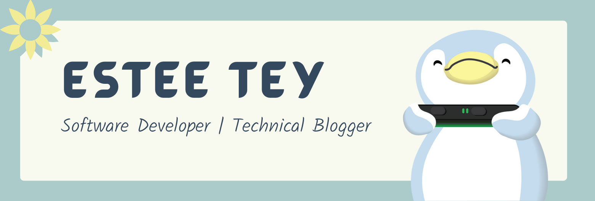

  
  
  
  
  

---

### Hello there 👋

- 💻 I'm Estee, a graduate Software Developer from Singapore (UTC+8).
- ⛵ I'm a [Thoughtworker](https://www.thoughtworks.com/) who has worked on several full-stack client projects.
- ✍ I write articles about UI, UX, Open Source and Web Development.
- 🎤 I have given 2 internal L&L sessions about Frontend Development.
- 🧡 I am open to opportunities to learn, write articles and speak in public about anything technical.

### Latest Articles 

<!-- BLOGPOST:START -->
- [Introduction to Scalable Vector Graphics &lpar;SVG&rpar;](https://esteetey.dev/introduction-to-svg)
- [My second attempt at Hacktoberfest: 2021 Edition](https://esteetey.dev/my-second-attempt-at-hacktoberfest-2021-edition)
- [Get the best out of Hacktoberfest as a contributor](https://esteetey.dev/hacktoberfest-newbie-contributor-guide)
- [The Open Source &amp; Hacktoberfest Anthology🌻🔖](https://esteetey.dev/the-open-source-and-hacktoberfest-anthology)
- [Simple tutorial to migrate a non-CRA React project to Next.js](https://esteetey.dev/migrating-a-simple-non-cra-react-project-to-nextjs)
<!-- BLOGPOST:END -->

### Languages & Tools 🛠

<table>
  <tr>
    <th>Frontend (Web)</th>
    <th>Backend</th>
    <th>Mobile</th>
    <th>Design</th>
  </tr>
  <tr>
    <td>
        
        
        
        
        
        
        
         
        
        
    </td>
    <td>
        
        
        
        
        
        
        
    </td>
    <td>
        
        
        
    </td>
    <td>
        
         
         
    </td>
  </tr>
</table>

<!--   -->

### Fun Projects

- 🔫 [Recoil](https://github.com/lyqht/Recoil): A downloadable 2D Platformer Game where Pingu the penguin takes up arms to save his eggy cousin Benedict from the Navy Seal.
- 🤖 [BuilderBuddy](https://github.com/lyqht/builderbuddy): A HoloLens II Mixed Reality App MVP to teach people how to build Gunpla models remotely
- 💻 [ISTD Exhibition](https://github.com/lyqht/istd-1d-exhibition-2020): A static website to showcase hundreds of real projects across 2 courses of Singapore University of Technology and Design.
- 🤍 [Reminiscene](https://github.com/lyqht/Reminiscence): A static website to showcase events happening in a school event for White Day.
